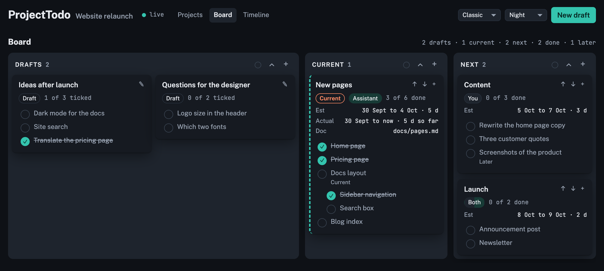
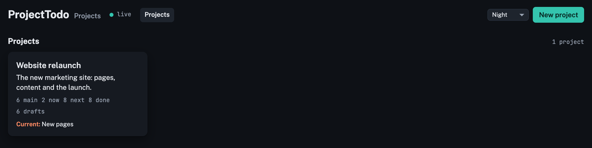
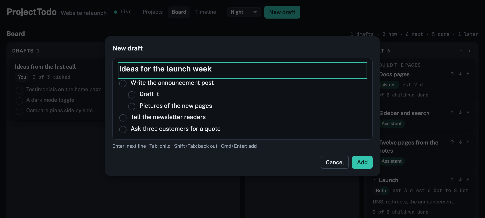
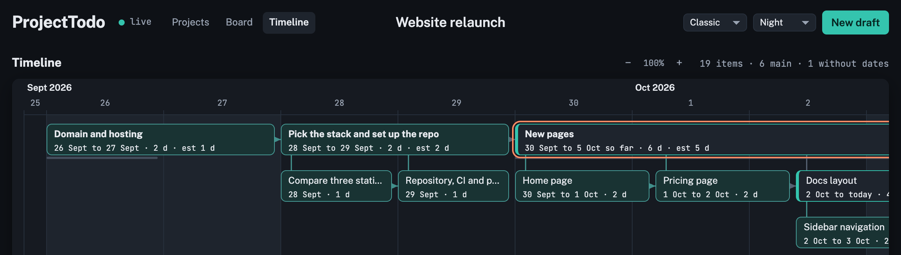
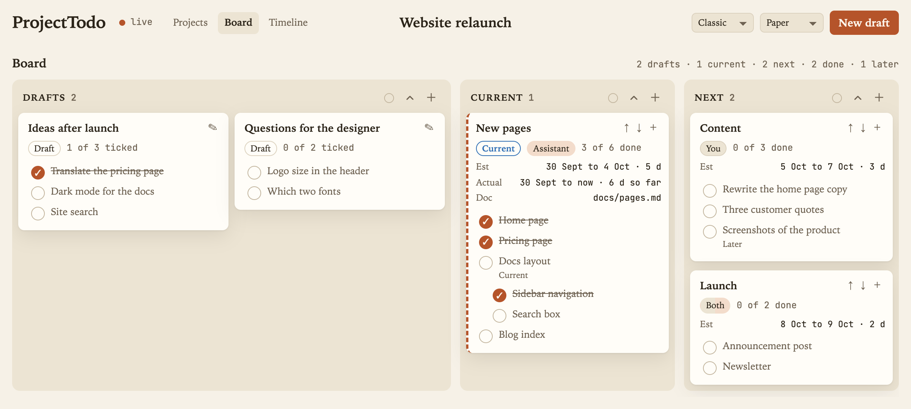
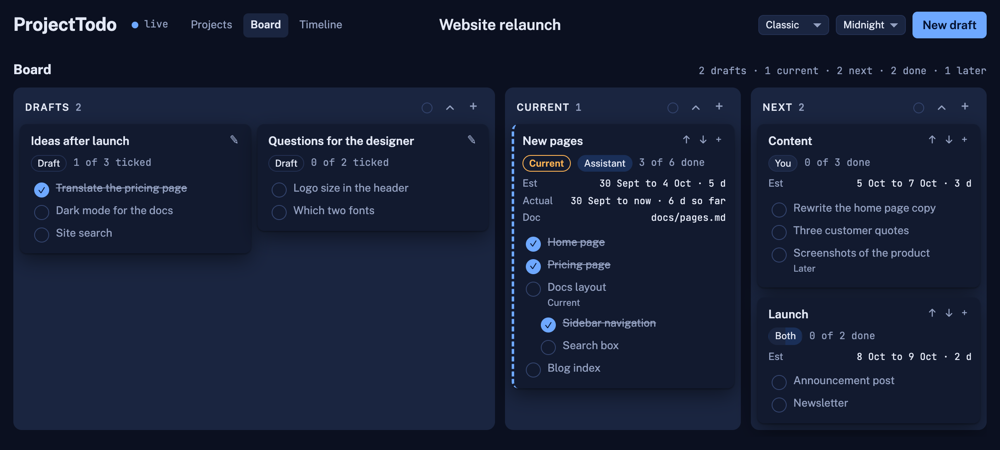
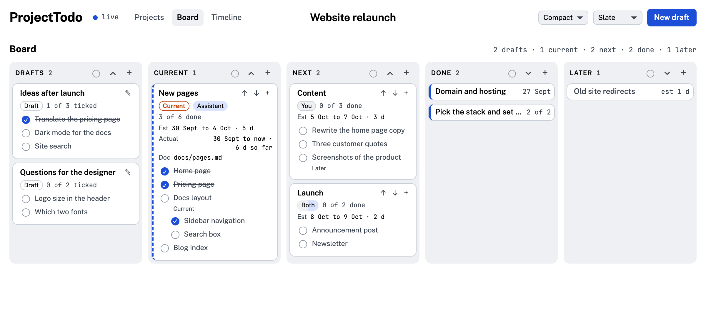
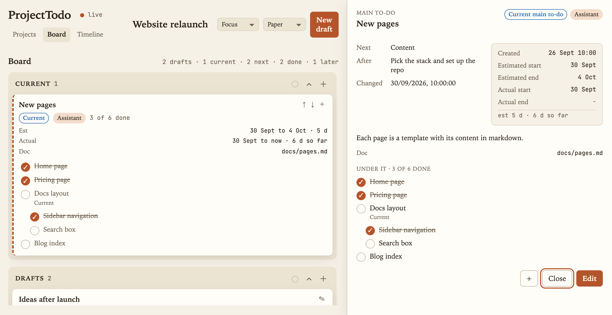
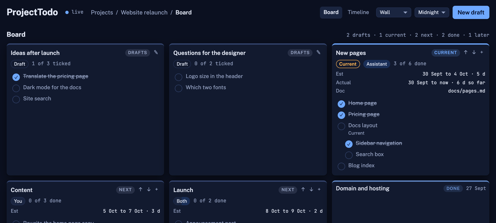
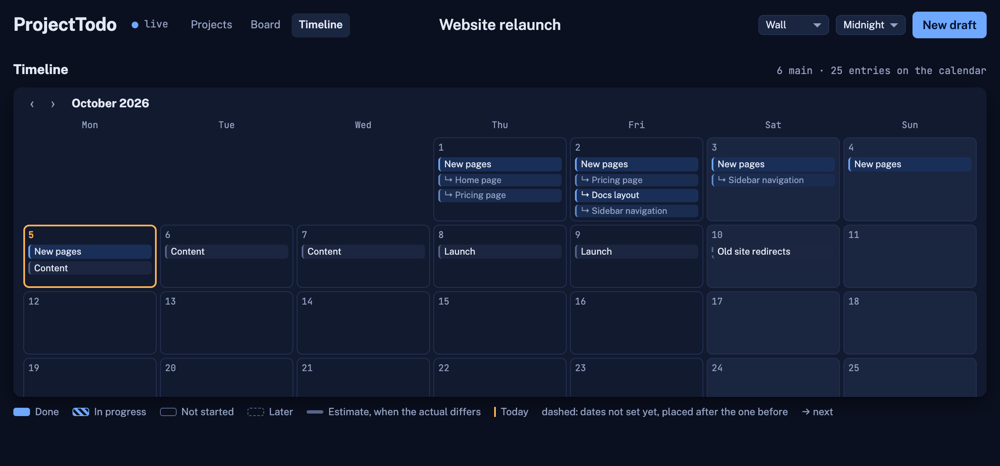

# ProjectTodo

A small to-do board for a person and their AI assistant, kept on your own machine. One
page, a JSON file, no dependencies, and an MCP server so the assistant you already use
(Claude Code, Claude Desktop, or anything that speaks MCP) can read and update the same
to-dos you see.



- **Projects** on the first page, each a card. Open one for its board; the pencil on a card
  edits its name, description and folders. A project can keep its to-dos in a folder of
  its own (`todos.json` inside it, so a repository can commit its own rows) and read and
  write its documents in its own folder; both are asked for when the project is made and
  default to the server's folders. The server reads and writes whichever folders you name,
  which is fine on your own machine and the reason it should stay there.
- **Board**: lanes for Drafts, Current, Next, Done and Later. Press **+** on Drafts (or
  "New draft") and type a title and a list like a notepad: Enter for the next line, Tab
  for a child, Shift+Tab back out; the pad is one text field, so you can select across
  lines, copy the list, or paste a list in (each line becomes a line). "Add" makes one
  draft card with those lines; the title can wait, an untitled draft is a loose list the
  assistant groups and titles when it is submitted, and a to-do needs a title before it
  leaves Drafts. You go through the drafts with your assistant; it fills in the details
  and moves them on.
  A card is a main to-do; everything under it is listed inside the card, ticked when
  done. Drag cards between lanes. Click a card's header to fold it to one row or open
  it again (Done and Later cards start folded); click the card's body or a line to see
  that to-do's details, with an Edit button there; double-click the header to edit the
  main to-do straight away; click a line's circle to tick it done.
  The + on a card, or in the details view, opens the pad without a title field: its lines
  become to-dos under that one, in its lane, with Tab making a child of the line above.
  A card cannot go to Done until every line in it is ticked. Each lane's header has an
  arrow that folds or opens every card in it, and a colour dot that colours the lane;
  drag a lane's header to move the lane. Order and colours are kept on the project.
  Drafts is twice as wide as the other lanes; Done and Later sit past the right edge and
  scroll into view.
- **Timeline**: dates along the top. A main to-do (one without a parent) spans its days,
  and one with a start time begins at that time and ends at its end time or at now, kept
  at least as wide as its tree needs; one with only an end time ends at that time. The boxes
  pack to the top in the board's order, all lanes together, each in the first row with
  room for it; rows are one box tall and a tree takes several, so a box can sit under
  another box whose tree does not reach there. Drag a box to any row where nothing
  is in its way (a band shows the row, red where there is no room) and it stays there; nothing
  else moves. A main to-do that has not started can also be dragged along the days to move
  its estimated dates, or stretched at either edge to change its estimated start or end;
  its to-dos hang under it, siblings left to right, children below their parent, in as
  many columns as its days allow. A main to-do with no dates is placed after the one
  before it. The thin line under a main to-do is its estimate when the actual days
  differ. The project's **current** main to-do is outlined: setting it starts it today;
  when it is done, its end is the end of the last finished to-do under it. So by
  finishing things, every to-do ends up with its real dates.
  A main to-do dropped into an empty Current lane becomes the current one; dropped beside
  another it is a second card in progress; moved out of Current or finished, it stops being
  current.
  The timeline opens on today, a line walks across today's column with the time (hover it
  to read it), and the view zooms with the − and + buttons, Cmd and scroll, or Cmd and
  minus, plus and 0.
- **Live**: every change saves at once and shows up for everyone with the page open.
- **On a phone**: one lane at a time on the board, swiped sideways; dialogs open at the top
  so the keyboard does not cover them; the draft pad has ‹ › buttons for levels since a phone
  has no Tab key; touch targets are larger and hover-only controls are always shown.
- **Themes**: Auto (follows the system), Day, Night, Midnight, Forest, Ember, Paper,
  Rose and Slate, from the menu in the header; remembered per browser.
- **Layouts**, from the menu beside the theme; a layout changes the structure, a theme the
  colours, and changing one leaves the other as chosen. **Classic** is the board above. **Compact** (pictured in Slate): every lane one unit wide,
  tighter cards and smaller type, smaller boxes on the timeline. **Focus** (pictured in Paper): one
  column with Current first, a click shows a to-do's details docked on the right instead
  of a modal, and the timeline is an agenda, one row per day with what starts, runs or
  finishes on it, times included; board and agenda end at the bottom of the window and
  scroll inside themselves, the agenda opening on today. **Wall** (pictured in Midnight): a grid of
  equal cards with the lane as a tag on each, and the timeline is a month calendar, one
  month in view, moved with the arrows or a sideways scroll; here a to-do changes lane
  through its form.

| Projects | Draft pad |
|---|---|
|  |  |



| Paper | Midnight |
|---|---|
|  |  |



| Focus (Paper) | Wall (Midnight) |
|---|---|
|  |  |



## Run it

```bash
./start.sh                                        # http://localhost:3004
./start.sh --port 3010 --data ~/notes/todos --docs ~/notes
```

Needs Node 18 or newer. `./start.sh --help` lists the flags; each one sets the
environment variable of the same meaning, so `node server.mjs` with the variables set
does the same. `./start.sh --dev` restarts the server whenever `server.mjs` or anything
under `public/` changes, and every open page reloads itself, so editing needs no
restarts by hand:

| Variable | Default | What |
|---|---|---|
| `PORT` | `3004` | the port |
| `HOST` | `127.0.0.1` | the address; `0.0.0.0` to reach it from other machines |
| `PROJECTTODO_DATA_DIR` | `./data` | where `todos.json` lives (commit it to your own repo if you like) |
| `PROJECTTODO_DOCS_DIR` | the data dir's parent | a to-do's `doc` is a markdown file under this folder, shown in a drawer |
| `PROJECTTODO_DOC_WRITE_DIR` | `todos` (inside the docs dir) | where the assistant's `write_doc` may create markdown files (`--write-docs`) |
| `PROJECTTODO_DEFAULT_PROJECT` | `My project` | the project made for rows from before projects existed |
| `PROJECTTODO_DEV` | unset | `1` watches the files and restarts (the `--dev` flag) |

## Connect your assistant (MCP)

The server speaks MCP at `POST /mcp` (streamable HTTP, stateless), and `mcp.mjs` is a
stdio bridge for clients that start a command. The server has to be running.

Claude Code:

```bash
claude mcp add projecttodo -- node /path/to/projecttodo/mcp.mjs
# or over HTTP
claude mcp add --transport http projecttodo http://localhost:3004/mcp
```

Claude Desktop (`claude_desktop_config.json`):

```json
{ "mcpServers": { "projecttodo": { "command": "node", "args": ["/path/to/projecttodo/mcp.mjs"] } } }
```

Any other MCP client: a stdio server `node mcp.mjs` (set `PROJECTTODO_URL` if the server
is not on `http://localhost:3004`), or the HTTP endpoint `http://localhost:3004/mcp`.
Clients that need a public HTTPS address (a hosted ChatGPT connector, for example) need
a tunnel in front of it; the server has no login, so keep it on your own machine or
behind one.

Tools: `get_playbook`, `list_projects`, `create_project`, `list_todos`, `get_todo`,
`create_todo`, `update_todo`, `delete_todo`, `set_current`, `add_draft`, `read_doc`,
`write_doc`. Prompts (clients that list MCP prompts, such as Claude Desktop, offer them
as commands): `review_drafts`, `submit_draft`, `plan_todo`, `daily_review`.

## Teach your assistant the workflow

Connecting the server tells an assistant what the tools are, not how you want the board
worked. That lives in one file, [PLAYBOOK.md](PLAYBOOK.md): the lanes, the rules (drafts
belong to the person; a to-do is done only when everything under it is done; no invented
estimates; a draft line is a to-do when it is a step of its own and goes into the notes or
the document when it is an instruction for the parent), how to review draft groups one at a time, how to plan a to-do with a
document, and the document template. The server sends a summary when a client connects,
and the `get_playbook` tool returns the whole file, so every MCP client can read it.

- **Claude Code**: install the skills once. The first makes Claude call `get_playbook`
  whenever the board comes up; the second is the `/projecttodo-draft-submission` command,
  which takes one draft group and submits it as planned to-dos, writing the plan document
  when the playbook's rule calls for one (`/projecttodo-draft-submission the first draft`,
  `/projecttodo-draft-submission "Board page updates", start it now`):

  ```bash
  mkdir -p ~/.claude/skills && cp -r /path/to/projecttodo/skills/* ~/.claude/skills/
  ```

  (or copy them into a project's `.claude/skills/` to keep them per repository).
- **Claude Desktop**: the summary arrives with the connection; the prompts above appear
  as commands.
- **Anything else** (a ChatGPT connector, another agent): add one line to its
  instructions: *Before working on the to-do board, call the projecttodo tool
  `get_playbook` and follow it.*

Plan documents are markdown files the assistant writes with `write_doc` into the write
folder (`--write-docs`, default `todos/` under the docs folder; a project with its own
documents folder writes straight into it) and links through the to-do's `doc` field; the
page shows them in the drawer, and `read_doc` reads them back. Both tools take the
`project_id`, and `list_projects` tells an assistant each project's folders.
Edit the playbook to fit how you work; the assistant reads it fresh each time.

## Rows

A project: `id, name, description, data_dir, docs_dir, lanes ({order, colors}), current_id,
created_at, updated_at, version`. `data_dir` and `docs_dir` are empty for the server's
defaults; the listing adds `paths` with the folders in use.

A to-do:

```
id, project_id, title, notes, parent_id (null = main to-do), next_id (the sibling after it),
order (10, 20, …), row (the timeline row a main to-do was dropped in; null = the first row
with room), status: draft | todo (Next) | doing (Current) | done | deferred (Later),
owner: user | assistant | both | null, doc (the plan), docs (further files, a list), estimate_days,
planned_start, planned_end (estimated start and end), actual_start, actual_done (actual start and end),
actual_start_time, actual_done_time (HH:MM, local; stamped by the server with the dates),
created_at (when it was added; the details view and the editor show it as Created), updated_at (ISO 8601),
version (kept by the server)
```

Estimates are days; under a day they show as hours at 8 hours a day, and the editor takes
"2 d", "3 h" or "90 m". A status change to Current or Done stamps the actual date and the
time of day, on the page and on the server, so a to-do that started at 12:43 and ended at
15:20 reads "4 Oct 12:43 to 15:20 · 2 h 37 m" on its card and sits by the hour on the
timeline. A to-do that finishes goes to the top of Done, above the ones finished before it (move it
afterwards if you like). A child that starts also starts its parents: a parent without an
actual start takes the child's. A dropped to-do lands where it was dropped, next links or not:
it leaves the chain it was in, and dropped between two linked to-dos it is linked between
them. Dropping a card in Current sets `actual_start` when empty; in Done sets `actual_done` (for a
main to-do, the end of its last finished child) and `actual_start` when empty; leaving
Done clears `actual_done`. A to-do can be set done only when everything under it is done:
the page checks this on drops, in the editor and on the ticks, and the server refuses such
a write with 409 `children_open`.
A main to-do dropped in Next or Current with no estimated dates
gets them: the day after the estimated end of the main to-do before it, lasting its
estimate in days (one day if none). Deleting a parent moves its children up one level.

## API (JSON)

| Call | Body | Does |
|---|---|---|
| `GET /api/projects` | | `{projects}` with counts and the current main to-do |
| `POST /api/projects` | `{data: {name, description}}` | makes a project |
| `PATCH /api/projects/{id}` | `{if_version, data: {name, description, current_id}}` | changes it; setting `current_id` starts that main to-do today |
| `DELETE /api/projects/{id}` | `{if_version}` | removes it and its to-dos |
| `GET /api/todos?project={id}` | | `{todos}` |
| `POST /api/todos` | `{data: {id, project_id, title, …}}` | creates a row (409 if the id exists) |
| `PATCH /api/todos/{id}` | `{if_version, data: {…}}` | merges fields; 409 `version_mismatch` when the row changed meanwhile, 409 `children_open` when it would be done with open to-dos under it, 400 `unknown_field` for a field the row does not have |
| `DELETE /api/todos/{id}` | `{if_version}` | removes a row |
| `POST /api/batch` | `{writes: [{op: set\|update\|delete, id, data, if_version}]}` | all or nothing |
| `GET /api/doc?path=docs/x.md` | | `{path, modified, content}` for a markdown file under the docs folder |
| `GET /api/events` | | server-sent `change` events |
| `POST /mcp` | JSON-RPC | the MCP endpoint |

## License

MIT.
